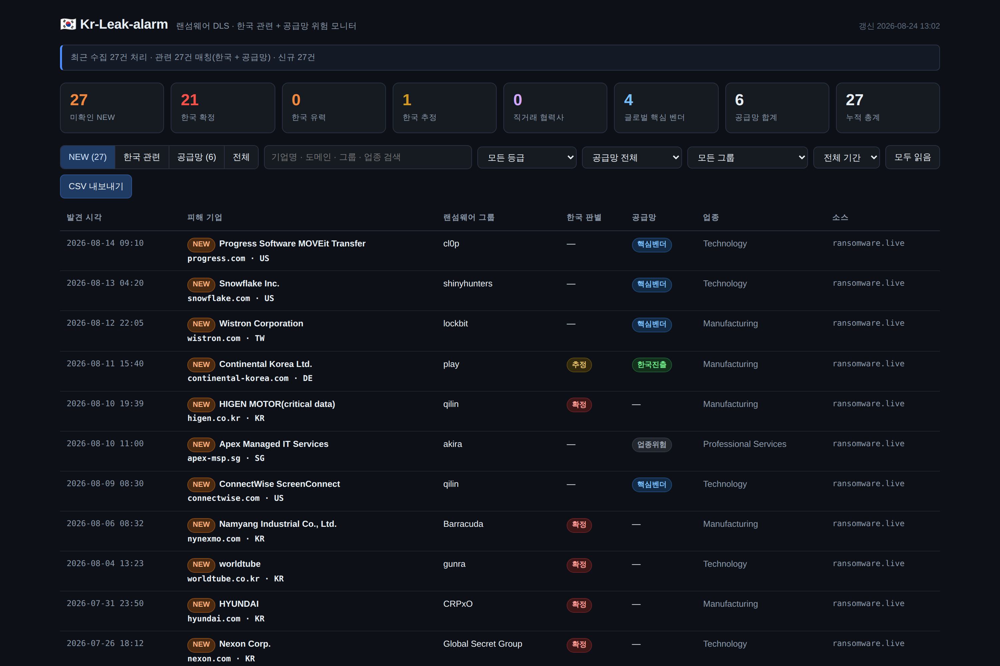
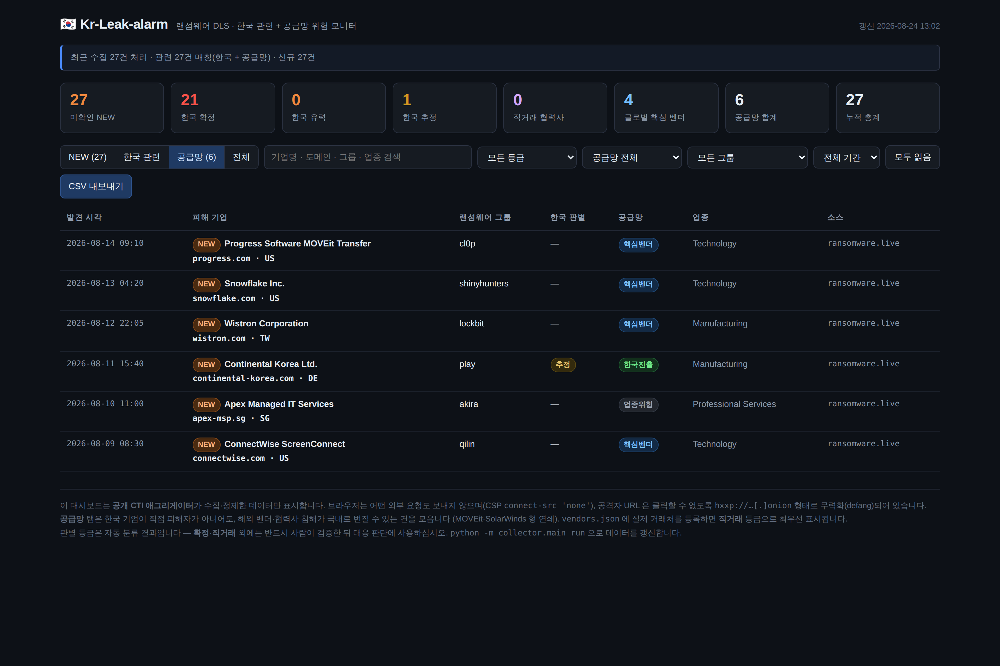
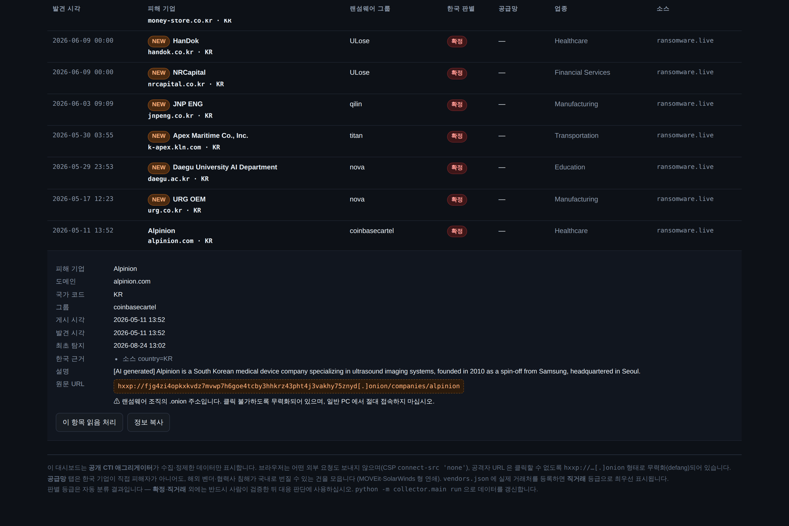

# 인수인계 문서 (HANDOFF)

> 이 문서는 **프로젝트를 넘겨받아 통합·수정할 사람**을 위한 것입니다.
> 사용법만 필요하면 [README.md](README.md), 보안 설계 근거는 [SECURITY.md](SECURITY.md) 를 보세요.

---

## 1. 한 문단 요약

랜섬웨어 조직이 유출 사이트(DLS)에 올린 피해 기업 중 **한국과 관련된 건**을 자동으로 골라내
로컬 웹 대시보드에 쌓고, 새로 올라온 건만 알림을 보내는 도구입니다.
판별은 **한국 관련성**과 **공급망 위험** 두 축으로 독립 수행합니다.
Python 수집기(CLI) + 단일 HTML 대시보드로 구성되며, 서버나 DB 인프라가 필요 없습니다.

**현재 상태: 동작합니다.** 실데이터로 검증했고 자체 테스트 149개가 통과합니다.
운영 중 발생한 사고(API 레이트리밋)도 원인 수정 + 회귀 테스트까지 반영되어 있습니다.

<br>

## 2. 화면

| NEW 리스트 | 공급망 탭 |
|---|---|
|  |  |

행을 클릭하면 판별 근거와 원문 URL(무력화됨)이 펼쳐집니다.



> 스크린샷의 기업명은 `ransomware.live` 가 이미 공개한 데이터의 스냅샷입니다.
> **이 저장소를 공개로 전환한다면 스크린샷도 함께 검토**해야 합니다(§8 참고).

<br>

## 3. 3분 안에 돌려보기

```bat
git clone <저장소 URL>
cd Kr-Leak-alarm

scripts\check-env.bat                       :: Python 설치 여부 확인
python scripts\make_demo_data.py            :: 샘플 데이터 (네트워크 불필요)
scripts\open-dashboard.bat                  :: 대시보드 확인

scripts\run.bat                             :: 실제 수집
```

`run.bat` 이 가상환경 생성 → 의존성 설치 → `config.json` 준비까지 전부 자동으로 합니다.
**첫 실행은 과거 이력을 기준선으로 적재하고 알림을 보내지 않습니다** — 정상 동작입니다.

<br>

## 4. 구조

```
                    ┌──────────────────────────────────────────┐
  공개 CTI API      │ ransomware.live · ransomlook · ransomfeed │
  (HTTPS)           └────────────────────┬─────────────────────┘
                                         │  packages/dc_safety/http.py
                                         │  허용목록 · HTTPS 강제 · 크기 상한
                    ┌────────────────────▼─────────────────────┐
  정규화            │ collector/sources/*.py  →  LeakRecord     │
                    │ 살균 · 필드명 통일 · 중복 제거 키 생성      │
                    └────────────────────┬─────────────────────┘
                            ┌────────────┴────────────┐
  이중 판별        ┌────────▼────────┐      ┌─────────▼─────────┐
                   │ kr_filter.py    │      │ supply_filter.py  │
                   │ 한국 관련성 4단계 │      │ 공급망 위험 4단계  │
                   └────────┬────────┘      └─────────┬─────────┘
                            └────────────┬────────────┘  OR 조건
                    ┌────────────────────▼─────────────────────┐
  저장              │ collector/store.py  →  SQLite (data/)     │
                    │ 처음 본 건만 is_new=1                      │
                    └──────────┬───────────────┬───────────────┘
                               │               │
                 ┌─────────────▼──┐      ┌─────▼──────────────────┐
  출력           │ notify.py      │      │ export.py → web/data/  │
                 │ 토스트/웹훅/메일 │      │ URL 무력화 지점         │
                 └────────────────┘      └─────┬──────────────────┘
                                               │
                                    ┌──────────▼─────────┐
                                    │ web/index.html     │
                                    │ 단일 파일 · 의존성 0 │
                                    └────────────────────┘
```

### 파일별 역할

| 파일 | 역할 | 수정 빈도 |
|---|---|---|
| `collector/main.py` | CLI 진입점, 실행 흐름 조립 | 중 |
| `collector/kr_filter.py` | 한국 관련성 판별 | **높음** |
| `collector/supply_filter.py` | 공급망 위험 판별 | **높음** |
| `collector/data/kr_keywords.json` | 한국 기업·기관 키워드 | **높음** |
| `collector/data/supply_keywords.json` | 글로벌 벤더 워치리스트 | **높음** |
| `collector/sources/*.py` | 소스별 API 어댑터 | 중 (API 변경 시) |
| `packages/dc_safety/http.py` | 네트워크 보안 계층 (허용목록 원본) | 낮음 |
| `collector/http_client.py` | 위 이름을 그대로 넘기는 껍데기. 여기를 고쳐도 효과 없음 | 낮음 |
| `collector/store.py` | SQLite 저장·NEW 상태 | 낮음 |
| `collector/export.py` | 웹 데이터 생성 | 낮음 |
| `web/index.html` | 대시보드 전체 | 중 |
| `collector/safety.py` | 살균·무력화·VM 탐지 | **건드리지 말 것** |

<br>

## 5. 어디를 고치면 뭐가 바뀌나

가장 자주 만지게 될 지점들입니다.

### 판별이 이상할 때

| 증상 | 고칠 곳 |
|---|---|
| 한국 기업인데 안 잡힘 | `collector/data/kr_keywords.json` → `conglomerates` / `entities` 에 추가 |
| 무관한 기업이 잡힘 | 같은 파일 `exclude` 에 추가, 또는 `config.json` 의 `kr_detection.exclude_keywords` |
| 벤더가 공급망으로 안 잡힘 | `collector/data/supply_keywords.json` → 해당 계층에 추가 |
| 노이즈가 너무 많음 | `config.json` → `kr_detection.min_tier_to_report` 를 `strong` 으로 올림 |
| 놓치는 게 걱정됨 | 같은 값을 `review` 로 내려서 한 번 훑어보기 |

> 키워드 추가 시 **단어 경계 매칭**이 적용됩니다. `kia` 같은 짧은 단어는 오탐이 나니
> `kia motors` 처럼 2단어 이상을 권장합니다. (`Nokia` 오탐 방어 테스트가 이미 있습니다.)

### 알림이 시끄럽거나 조용할 때

```json
"notify": {
  "kr_min_score": 60,            // 한국 관련: 60=추정, 80=유력, 100=확정
  "supply_min_tier": "critical", // 공급망: direct > critical > korea_ops > sector
  "resync_threshold": 30         // 이 건수 넘으면 재동기화로 보고 알림 생략
}
```

### 우리 회사 협력사 등록 (정확도가 가장 크게 오르는 지점)

`vendors.example.json` → `vendors.json` 으로 복사 후 실제 거래처 도메인 입력.
등록된 회사가 뜨면 국가 무관하게 최상위 `직거래` 등급으로 즉시 알림됩니다.
**이 파일은 `.gitignore` 로 커밋이 차단됩니다** — 거래처 목록이 저장소에 올라가지 않습니다.

### 소스 추가

`collector/sources/base.py` 의 `Source` 를 상속해 `fetch()` 만 구현하고,
`collector/sources/__init__.py` 의 `REGISTRY` 에 등록하면 됩니다.
`LeakRecord(...).finalize()` 를 호출하면 살균·정규화·중복키 생성이 자동으로 됩니다.

<br>

## 6. 통합 지점 (다른 시스템에 붙일 때)

수집 결과는 매 실행마다 **두 가지 형태**로 나갑니다.

```
web/data/latest.json    ← 표준 JSON. 외부 시스템 연동은 이걸 쓰세요.
web/data/data.js        ← 대시보드 전용 (window.KRLEAK = {...})
data/krleak.db          ← SQLite 원본. 직접 쿼리해도 됩니다.
```

### `latest.json` 스키마

```jsonc
{
  "schema_version": 1,
  "generated_at": "2026-08-24T04:00:00+00:00",
  "stats": { "total": 152, "new": 3, "confirmed": 120, "supply_critical": 4, ... },
  "items": [
    {
      "uid": "a1b2…",                    // 안정적 식별자 (그룹+피해자 해시)
      "victim": "SAMPLEMOTOR MOTOR",
      "group": "qilin",
      "country": "KR",                   // ISO-2, 없을 수 있음
      "sector": "Manufacturing",
      "website": "samplemotor.co.kr",
      "description": "…",                // 조직이 작성한 문자열 (살균됨)
      "published": "2026-08-10T19:39:03+00:00",
      "discovered": "2026-08-10T19:39:24+00:00",
      "post_url_defanged": "hxxp://xxx[.]onion/…",  // ★ 무력화된 형태로만 제공
      "post_is_onion": true,
      "sources": ["ransomware.live"],
      "tier": "confirmed", "score": 100, "reasons": ["소스 country=KR"],
      "supply_tier": "none", "supply_score": 0, "supply_reasons": [],
      "first_seen": "2026-08-16T09:05:00+00:00",
      "is_new": false
    }
  ]
}
```

**연동 시 주의 3가지**

1. `uid` 로 중복을 판단하세요. 같은 피해자가 여러 소스에서 오면 이미 병합되어 있습니다.
2. `victim` / `description` 은 **랜섬웨어 조직이 쓴 문자열**입니다. 살균은 되어 있지만
   최종 렌더링 시점에도 이스케이프하세요. HTML 에 넣을 땐 반드시 `textContent`.
3. `post_url_defanged` 는 **일부러 깨뜨린 문자열**입니다. 원상복구해서 접속하지 마세요.
   원본이 필요하면 SQLite 의 `post_url` 컬럼에 있지만, 그걸 쓰는 순간 이 도구의 보안 전제가 깨집니다.

<br>

## 7. 설계 결정과 그 이유

넘겨받은 뒤 "왜 이렇게 했지?" 싶을 지점들입니다. 바꾸기 전에 읽어주세요.

### .onion 을 직접 크롤링하지 않는다

`ransomware.live` 같은 공개 CTI 프로젝트가 이미 150개 이상 조직의 DLS 를 24시간 크롤링해
정제된 JSON 으로 공개합니다. 같은 일을 직접 하면 얻는 것은 거의 없고 **실행 PC 를 랜섬웨어
인프라에 직접 노출**시키는 위험만 커집니다. 게다가 애그리게이터는 `country` 필드를 이미
붙여주므로 한국 판별 정확도가 오히려 더 높습니다.

Tor 크롤러(`tor/onion_crawler.py`)는 연구 목적으로 넣어뒀지만 **3중 게이트**(설정 + 명시적
플래그 + VMware 가상머신 검증)를 전부 통과해야만 동작합니다. 기본은 완전 차단입니다.

### 판별을 두 축으로 나눈 이유

처음엔 `country=KR` 하나만 봤는데, 그러면 **MOVEit·SolarWinds 형 공급망 연쇄를 통째로
놓칩니다.** 한국 기업이 피해자로 안 올라와도 그 기업이 쓰는 벤더가 털리면 국내로 번지니까요.
그래서 축을 분리하고 OR 로 묶었습니다. 두 축은 서로 간섭하지 않습니다.

### 벤더명을 그룹명에 매칭하지 않는 이유

`Barracuda`, `Titan`, `Nova` 는 **보안 벤더명이면서 동시에 랜섬웨어 그룹명**입니다.
실제 데이터에 `group_name: Barracuda` 가 존재합니다. 여기서 섞이면 전수 오탐이 나므로
`supply_filter.py` 는 피해자 필드만 봅니다. 이 동작은 테스트로 고정되어 있습니다.

### 대시보드가 단일 HTML 인 이유

빌드 도구·프레임워크·패키지 매니저 없이 **파일 더블클릭으로 열립니다.** 인수인계와
사내 공유에서 이게 가장 마찰이 적습니다. 데이터는 `<script src>` 로 읽어 `file://` 에서도
동작합니다. React 등으로 바꾸면 이 장점이 사라지니 신중히 결정하세요.

### 의존성이 `requests` 하나뿐인 이유

공급망 보안 도구가 정작 자기 공급망 공격 표면이 넓으면 앞뒤가 안 맞습니다.
나머지는 전부 표준 라이브러리입니다. 새 의존성을 추가할 땐 이 원칙을 의식적으로 깨는 것인지
확인해 주세요.

<br>

## 8. 알려진 한계 · 리스크

### 데이터 신뢰도

DLS 게시물은 **랜섬웨어 조직의 일방적 주장**입니다. 실제 침해 여부·규모가 다를 수 있고,
과거 사건 재게시이거나 완전한 허위인 경우도 있습니다.
`확정` 등급 외에는 **반드시 사람이 검증**한 뒤 대응 판단에 쓰십시오.

### ★ 공개 저장소로 전환 시 법적 리스크

현재 `.gitignore` 가 `web/data/` 와 `data/` 를 제외하므로 **코드만 올라가고 수집 데이터는
로컬에 남습니다.** 이 상태를 유지하는 것을 강력히 권장합니다.

공개 저장소에 데이터까지 올리면 **"이 한국 기업들이 침해당했다"를 실명으로 공표**하는
것이 됩니다. 원본이 이미 공개되어 있어도, 국제 CTI 프로젝트가 면책 고지와 함께 운영하는
것과 개인·팀이 한국 기업만 추려 재게시하는 것은 성격이 다릅니다.
정보통신망법상 명예훼손은 사실 적시도 대상이며, 자동 분류 오탐까지 섞이면 위험이 커집니다.

공개가 필요하다면 **기업명을 가리고 통계만**(월별 건수·그룹 순위·업종 분포) 내보내는
방식을 권합니다. `export.py` 에 집계 전용 모드를 추가하면 됩니다.

### API 레이트리밋 (실제 발생한 사고)

2026-08-19, 벤더 순회 검색이 재시도까지 포함해 수백 건을 몇 분 안에 호출해
`api.ransomware.live` 에서 **IP 차단**을 당했습니다. 하루 정도 뒤 자동 해제됐습니다.

수정 완료된 사항:
- 4xx 는 재시도하지 않음 (429 만 재시도)
- 핵심 조회 실패 시 벤더 검색을 **아예 시작하지 않음** (회로 차단기)
- 벤더 검색 중 연속 3회 실패 시 조기 중단
- 기본값 완화: 실행당 5개, 3초 간격

**요청량을 늘리는 방향으로 수정할 때는 이 사고를 기억해 주세요.** 회귀 테스트가 있습니다.

### 미완성 / 개선 여지

| 항목 | 메모 |
|---|---|
| `ransomfeed.it` 소스 | 구현되어 있으나 노이즈가 많아 기본 비활성 |
| 대시보드 상위 1000건 제한 | 그 이상은 검색으로 좁혀야 함. 페이지네이션 미구현 |
| 읽음 상태가 브라우저별로 분리 | `localStorage` 기반. `file://` 과 `localhost` 가 별도 저장소 |
| 한글 기업명 매칭 | 한글은 단어 경계 개념이 없어 부분 매칭. 짧은 키워드 주의 |
| 알림 채널 | 토스트/웹훅/이메일만. 팀 협업 도구 연동은 미구현 |

<br>

## 9. 검증 방법

```bash
python -m tests.test_all      # 149개 — 외부 의존성 없이 실행
python -m collector.main doctor   # 환경·보안 설정 점검
```

단순 기능 테스트가 아니라 **실제 공격 페이로드를 넣어 방어가 동작하는지** 확인합니다.
XSS·SQL 인젝션·SSRF·CSV 인젝션·API 스키마 변경·레이트리밋 회로차단 등이 포함됩니다.

**코드를 수정한 뒤에는 반드시 이걸 돌려주세요.** 특히 `safety.py`,
`packages/dc_safety/http.py`, `store.py` 를 건드렸다면요.

<br>

## 10. 다음 단계 후보

우선순위 순으로, 판단 근거와 함께 적습니다.

1. **`vendors.json` 에 실제 협력사 등록** — 코드 수정 없이 정확도가 가장 크게 오릅니다.
   현재 공급망 판별은 일반론적인 큐레이션 목록에만 의존합니다.
2. **판별 결과 검토 루프** — `추정`·`검토필요` 등급을 사람이 확인하고 그 판정을 키워드에
   반영하는 절차. 지금은 근거만 보여주고 피드백 경로가 없습니다.
3. **집계 전용 내보내기** — §8 의 공개 리스크를 해소하면서 대외 공유가 가능해집니다.
4. **수집 이력 추이** — `runs` 테이블에 데이터가 쌓이고 있으나 시각화가 없습니다.
5. **알림 채널 확장** — 팀에서 쓰는 도구에 맞춰. 구조는 `notify.py` 에 이미 분리돼 있습니다.

<br>

---

## 인수인계 체크리스트

- [ ] `scripts\check-env.bat` 실행 — Python 환경 확인
- [ ] `python scripts\make_demo_data.py` → `scripts\open-dashboard.bat` — 화면 확인
- [ ] `scripts\run.bat` — 실제 수집 동작 확인
- [ ] `python -m tests.test_all` — 149개 통과 확인
- [ ] `git status` — `.env` / `config.json` / `data/` / `web/data/` 가 목록에 **없는지** 확인
- [ ] §7 설계 결정 읽기 — 특히 .onion 미크롤링, 이중 축, 그룹명 미매칭
- [ ] §8 공개 리스크 확인 — 저장소 공개 여부 결정 전 필독
